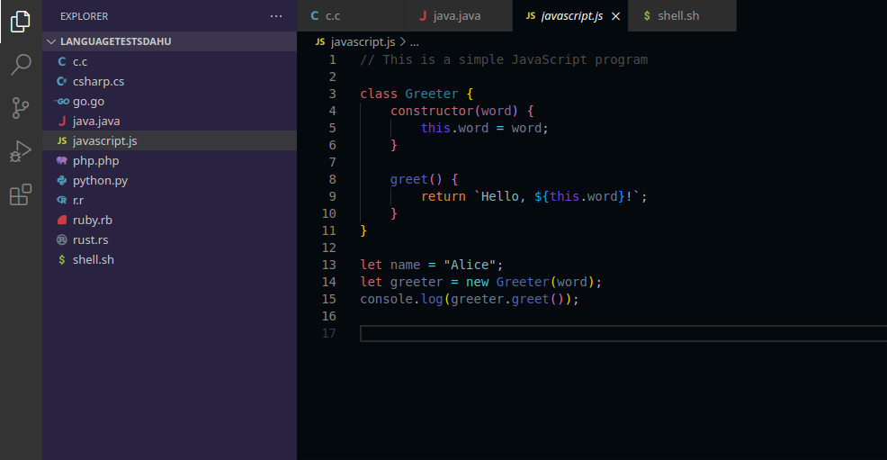

# README

Dahu is advanced color theme extension for Visual Studio Code.

## Features

- Changing code editor, sidebar, status bar, tabs and panel background colors to whatever you like.
- Changing code syntax colors (class names, variables, keywords, functions, etc.) to whatever you like.
- Saving the current color combination to a preset and naming it whatever you like.
- Choosing a preset from saved ones and applying it.

The following image was used to generate the theme for Visual Studio Code. 
 
Image:

  

 
Visual Studio Code theme:
  

  

### Language support

This extension currently offers code syntax highlighting support for these languages:
- C
- C#
- Go
- Java
- Python
- JavaScript, TypeScript
- PHP
- R
- Ruby
- Rust
- Shell

For other languages, it might not highlight the code syntax fully -> look for future updates.

## Requirements

- Only Visual Studio Code is required to run the extension.

## About color generation
This extension uses some APIs to provide functionality of generating colors from a base color or image. For generating color palette from a base color, we used [Palette.es API](https://palett.es/about), and for creating set of colors from a image we chose [Color Thief API](https://lokeshdhakar.com/projects/color-thief/#examples).

## Extension Settings
Currently, extension does not have any settings -> look for future updates
**Enjoy!**
